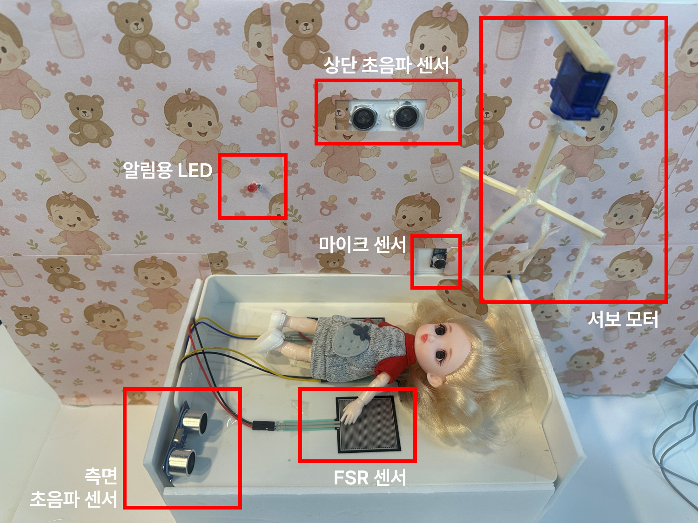
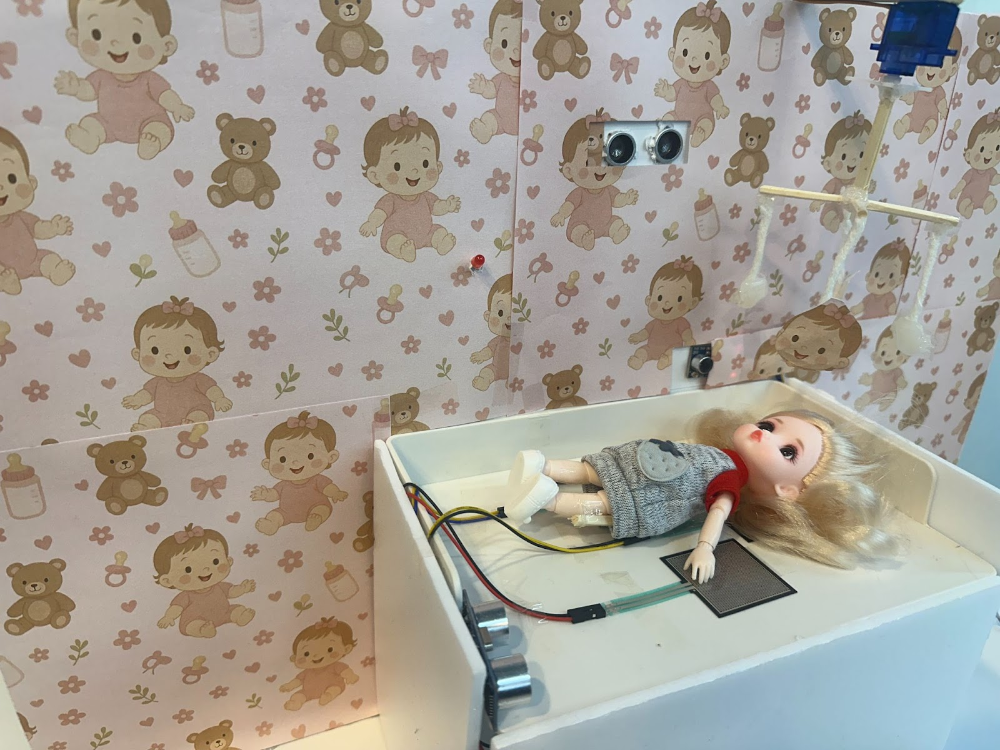
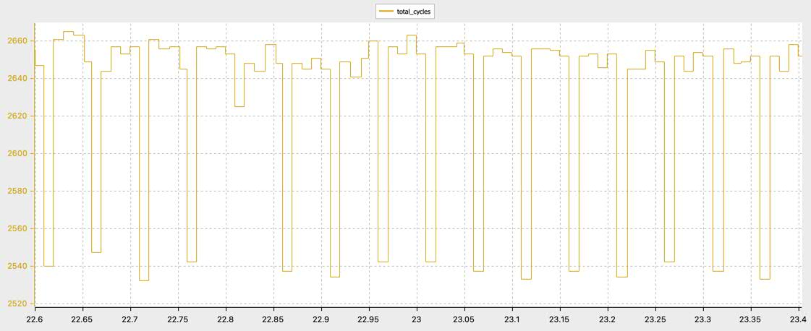
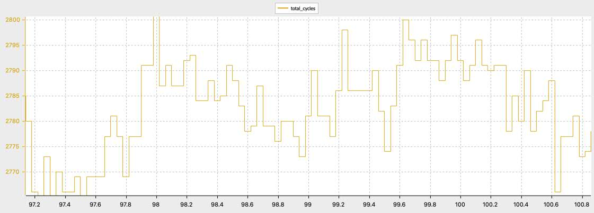
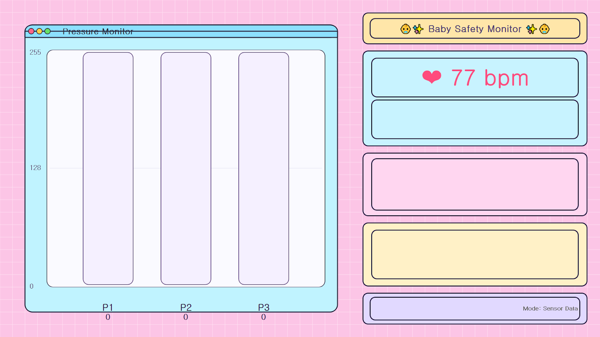
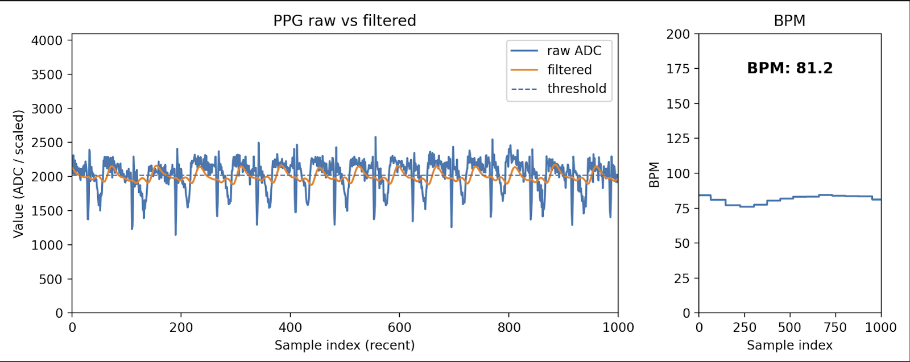
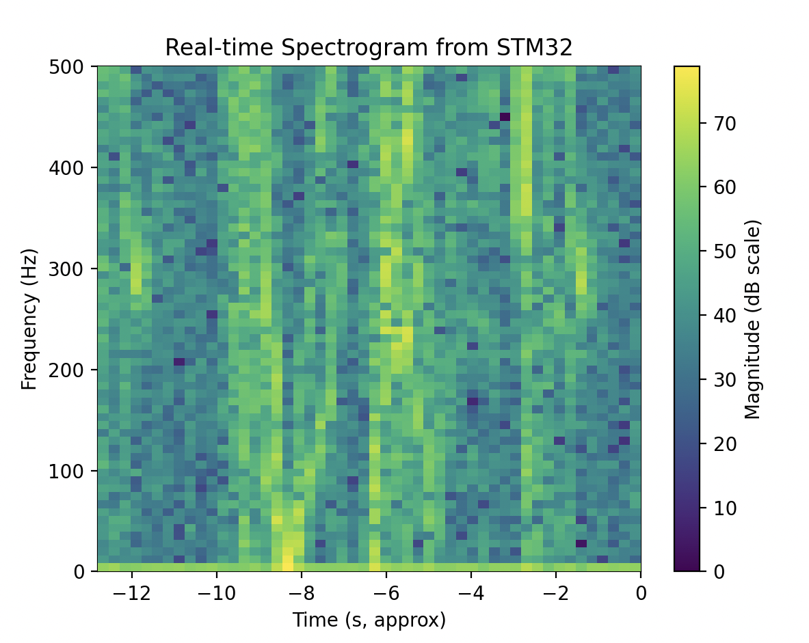

# STM32 기반 영아 수면 모니터링 시스템

영아의 심박수, 압력, 거리, 울음을 실시간으로 수집하고 위험 상황을 자동으로 분류해 보호자에게 경보하는 멀티보드 임베디드 시스템.  
STM32F103(Cortex-M3) 마스터 보드가 SPI로 두 슬레이브 보드에서 센서 데이터를 수집하고, UART로 Python GUI에 전송.

<p align="center">
  <br>
  <sub>초음파 센서(자세, 낙상 감지), FSR 압력 센서 3개, 마이크(울음 감지), 서보 모터(모빌) 탑재</sub>
</p>

<p align="center">
  <br>
  <sub>실제 시연 모습</sub>
</p>


---

## 프로젝트 배경

영아는 스스로 위험을 표현할 수 없어 보호자가 자리를 비운 짧은 시간에도 위험 상황이 발생할 수 있다. 시중의 영아 모니터는 영상 카메라 기반이 많아 **조명이 어두운 환경이나 다중 센서 이상을 동시에 감지하기 어렵다.**

이 프로젝트는 **심박수, 압력, 거리, 울음 4가지 센서를 복합적으로 활용**해 심정지, 낙상, 위험 자세, 울음을 각각 독립적으로 감지하고, 이벤트 우선순위에 따라 슬레이브 보드를 제어하는 계층적 시스템을 구현하였다.

---

## 시스템 구조

```
┌─────────────────────────────────────────────────────────────┐
│                  Master (STM32F103RB)                       │
│                                                             │
│  SPI1 (Polling/DMA) ←── Slave1 (BPM + FSR 압력센서 3개)    │
│  SPI2 (DMA)         ←── Slave2 (초음파 거리 + 울음 감지)    │
│                                                             │
│  영아 상태 분류 → 이벤트 감지 → Slave 제어 명령 송신        │
│                         │                                   │
│                    UART (115200)                            │
│                         │                                   │
└─────────────────────────┼───────────────────────────────────┘
                          ▼
                     PC GUI (Python)
```

---

## 본인 기여

팀 프로젝트에서 **Slave2 통신, DMA 성능 분석, GUI 통신 프로토콜 설계 및 구현, 보고서 작성** 담당.

### Slave2 보드 통신 및 낙상 감지 로직

초음파 거리 센서(HC-SR04 2개)와 울음 감지 센서를 탑재한 Slave2와의 SPI2 DMA 통신 구현.  
Slave2로부터 수신한 6바이트 프레임(`[HDR, CRY_FLAG, DIST1, DIST2, STATUS2, CS]`)을 파싱하고, 초음파 거리 기준으로 낙상 위험을 판별하는 로직 작성.

SPI 클록 위상 차이로 수신 프레임이 2바이트 밀리는 문제 발생. `Remap_Slave2Frame()` 함수로 오프셋을 보정해 항상 올바른 바이트 위치에서 데이터를 파싱하도록 해결.

### Polling vs DMA 성능 비교 분석

Cortex-M3의 DWT(Data Watchpoint and Trace) 사이클 카운터를 직접 활성화해 SPI 프레임 전송 시 Polling 방식과 DMA 방식의 CPU 점유 사이클 수를 측정하고 비교.

```c
// DWT 사이클 카운터 활성화
CoreDebug->DEMCR |= CoreDebug_DEMCR_TRCENA_Msk;
DWT->CYCCNT = 0;
DWT->CTRL   |= DWT_CTRL_CYCCNTENA_Msk;

uint32_t start = DWT->CYCCNT;
// ... SPI 전송 ...
g_spi1_xfer_cycles = DWT->CYCCNT - start;
```

Polling 방식은 바이트마다 TXE/RXNE 플래그를 폴링해 CPU가 대기하는 반면, DMA 방식은 전송을 DMA 컨트롤러에 위임해 CPU 점유를 최소화.

<p align="center">
  
  &nbsp;&nbsp;
  
  <br>
  <sub>좌: DMA 방식 — 사이클 수 안정, 변동 폭 작음 &nbsp;|&nbsp; 우: Polling 방식 — 사이클 수 높고 불규칙</sub>
</p>

### GUI 통신 프로토콜 설계 및 Python GUI 구현

STM32에서 UART(115200bps)로 8바이트 고정 패킷을 전송하는 `GUI_SendEvent()` 함수 설계 및 구현.

```
패킷 구조 [8 bytes]
[0] P1(FSR 좌)  [1] P2(FSR 중)  [2] P3(FSR 우)  [3] HR(BPM)
[4] HR_ABN      [5] FALL(낙상)  [6] STAND(자세) [7] CRYING(울음)
```

Python에서 UART 데이터를 수신해 영아 상태를 실시간으로 시각화하는 GUI 구현.

<p align="center">
  
</p>

---

## 기술적 문제 해결

### 1. SPI 프레임 바이트 오정렬

SPI 클록 위상(CPOL/CPHA) 설정 차이로 마스터가 수신하는 Slave2 프레임이 2바이트 밀려 항상 잘못된 위치의 값을 읽는 문제.  
→ `Remap_Slave2Frame()`으로 수신 버퍼에서 헤더 바이트(`0xB2`)를 탐색하고, 이후 바이트를 올바른 순서로 재배치해 해결.

### 2. 다중 이벤트 우선순위 충돌

심정지, 낙상, 자세 이상, 울음이 동시에 감지될 때 모든 명령을 슬레이브에 동시 전송하면 제어 신호 충돌.  
→ 이벤트 우선순위(심정지 > 낙상 > 자세 > 울음)를 정의하고, 가장 높은 우선순위의 명령 하나만 슬레이브에 전송하도록 설계.

### 3. IIR 필터링 후 압력 기반 상태 분류

FSR 센서 원시값이 노이즈가 커 단순 임계값 비교로는 오분류가 잦음.  
→ IIR 저역통과 필터(α=0.1)를 적용해 영아의 움직임 패턴에서 EMA 활동성 점수를 산출하고, EMPTY / DEEP_SLEEP / RESTLESS / ROLLOVER 4상태로 분류.

---

## 주요 기능

| 기능 | 설명 |
|:---|:---|
| 영아 상태 분류 | FSR 3개 + IIR 필터 + EMA 활동성 점수 → EMPTY / DEEP_SLEEP / RESTLESS / ROLLOVER |
| 심정지 감지 | no_pulse 플래그 30프레임 이상 지속 시 긴급 경보 |
| 낙상 위험 감지 | 초음파 거리 < 7cm 조건 3프레임 지속 시 경보 |
| 위험 자세 감지 | 중앙 FSR ≥ 70 (뒤집힘) 5프레임 지속 시 경보 |
| 울음 감지 | cry_flag 5프레임 지속 → 모터 진정 모션 |
| 슬레이브 제어 | 이벤트 우선순위에 따라 LED / 부저 / 모터 명령 송신 |
| 시뮬레이션 모드 | 보드 버튼으로 정상 / 심정지 모드 전환 (200ms 디바운싱) |

---

## 동작 결과

<p align="center">
  
  &nbsp;&nbsp;
  
  <br>
  <sub>좌: PPG 심박수 측정 (raw vs IIR 필터) &nbsp;|&nbsp; 우: 울음 감지 실시간 스펙트로그램</sub>
</p>

---

## 통신 구조

```
SPI1 (Slave1, Polling or DMA)
  Master TX: [0xA1, CMD, 0, 0, 0, 0, 0]             (7 bytes)
  Slave1 RX: [0xB1, BPM, STATUS, FSR1, FSR2, FSR3, CS]

SPI2 (Slave2, DMA)
  Master TX: [0xA2, MOTOR_CMD, 0, 0, 0, 0]           (6 bytes)
  Slave2 RX: [0xB2, CRY_FLAG, DIST1, DIST2, STATUS2, CS]

UART2 → GUI
  TX: [P1, P2, P3, HR, HR_ABN, FALL, STAND, CRYING]  (8 bytes, 고정)
```

---

## 기술 스택

| 분류 | 사용 기술 |
|:---|:---|
| MCU | STM32F103RB (Cortex-M3, 64MHz) |
| 언어 | C (STM32 HAL + 레지스터 직접 제어 혼용) |
| 통신 | SPI (Master 2채널), UART (115200bps) |
| DMA | DMA1 Ch2/3 (SPI1), Ch4/5 (SPI2) |
| 성능 측정 | DWT 사이클 카운터 |
| GUI | Python (UART 수신, 실시간 시각화) |
| IDE | STM32CubeIDE |

---

## 소스 코드 구조

```
Core/
├── Src/
│   ├── main.c              # SPI 초기화, 메인 루프, 상태 판단, 이벤트 감지
│   ├── stm32f1xx_it.c      # 인터럽트 핸들러 (EXTI 버튼, DMA)
│   └── stm32f1xx_hal_msp.c # HAL 주변장치 초기화
└── Inc/
    ├── main.h
    └── stm32f1xx_hal_conf.h
gui/
└── gui.py                  # Python UART 수신 + 실시간 시각화
```

---

## 빌드 및 실행

STM32CubeIDE에서 프로젝트를 열고 빌드 후 보드에 플래싱.

```
File → Import → Existing Projects → 이 폴더 선택
Project → Build All
Run → Debug (ST-Link)
```
